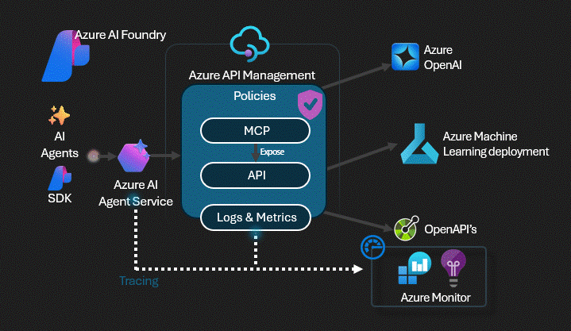

# Azure ML Model as MCP Server

> **This lab is hosted externally.** View the full lab at: [Azure-Samples/AI-Gateway](https://github.com/Azure-Samples/AI-Gateway/tree/main/labs/azure-ml-models)

Deploy a pre-trained sklearn forecasting model to an Azure ML managed online endpoint, expose it as a REST API through Azure API Management, and wrap it as an MCP server for cloud-based agents in Azure AI Foundry.
