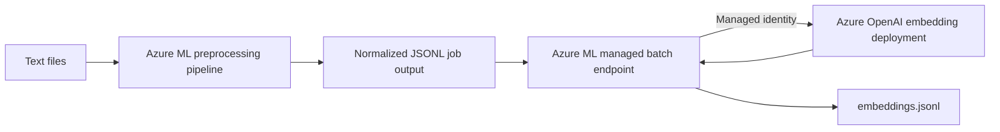

# Batch Document Embeddings

Generate vector embeddings for document collections with Azure OpenAI and an
Azure Machine Learning managed batch endpoint.

---

## Problem Statement

Search, recommendation, deduplication, and retrieval-augmented generation all
need vector representations of existing text. Large document collections are a
poor fit for synchronous APIs: they require repeatable preprocessing, scalable
compute, failure tracking, and durable outputs.

This industry-agnostic lab uses an Azure ML SDK v2 pipeline to normalize text
records, then invokes a managed batch endpoint that generates embeddings through
Azure OpenAI. The endpoint authenticates with the compute cluster's managed
identity, so no API keys are stored in source code or deployment settings.

---

## Dataset

The checked-in `data/sample-documents.jsonl` contains five synthetic maintenance,
support, logistics, and policy records. Each record uses this schema:

```json
{"id": "document-001", "text": "Text to embed."}
```

The preprocessing step also accepts `.txt`, `.csv`, and `.json` files. CSV files
must have a `text` column and may have an `id` column. JSON records follow the
same schema as JSONL. Blank text is discarded and missing IDs are generated.

---

## Architecture



The Azure ML compute identity needs permission to call Azure OpenAI. Input and
output artifacts remain associated with Azure ML jobs for lineage and auditing.

### Why use an Azure ML batch endpoint?

Microsoft Foundry batch deployments do not currently support embedding models.
This pattern fills that gap without hosting or copying the embedding model: the
Azure ML scoring job calls the existing Foundry model deployment through its
data-plane API.

It also provides benefits beyond model compatibility:

- **Custom preprocessing:** Validate, normalize, filter, and chunk multiple file
  formats before sending text to the embedding model.
- **Durable asynchronous execution:** Submit large collections as jobs, stream
  status, retain outputs, and inspect failed jobs instead of keeping a client
  process connected to a synchronous API.
- **Independent scaling:** Azure ML compute scales to zero when idle and can be
  sized separately from the Foundry model deployment. The scoring code controls
  mini-batches and concurrency so they can be tuned against model quotas.
- **Keyless authentication:** The compute cluster uses its managed identity and
  the `Cognitive Services OpenAI User` role; no API key is placed in code,
  pipeline inputs, or deployment settings.
- **Lineage and auditability:** Azure ML records the preprocessing run, input and
  output URIs, deployment version, logs, status, and generated artifacts.
- **Repeatable deployment contract:** The scoring environment, code, model
  contract, endpoint, and default deployment are versioned and updated through
  one SDK v2 workflow.
- **Downstream integration:** The durable JSONL output can feed Azure AI Search,
  data pipelines, clustering jobs, or retrieval systems without coupling those
  consumers to the live embedding request.

Azure ML does not bypass Foundry rate limits, token charges, content filtering,
or regional availability. Concurrency and mini-batch size must still respect the
quota of the selected embedding deployment, and the Azure ML compute and storage
used by the jobs add their own cost.

---

## Prerequisites

- Python 3.10 or later
- An Azure subscription and Azure ML workspace
- An Azure OpenAI resource with an embedding model deployment
- Azure CLI authenticated with `az login`
- Contributor access to the Azure ML workspace
- Permission to assign the `Cognitive Services OpenAI User` role

Install the local orchestration dependencies:

```bash
python -m venv .venv
source .venv/bin/activate
python -m pip install -r requirements.txt
```

On PowerShell, activate with `.venv\Scripts\Activate.ps1`.

---

## Configure Access

Give the compute cluster a system-assigned managed identity. The lab does this
automatically when it creates a cluster with `--create-compute`. For an existing
cluster, enable the identity in Azure ML Studio or with the Azure CLI.

Assign the least-privileged Azure OpenAI data-plane role to that identity:

```bash
COMPUTE_PRINCIPAL_ID=$(az ml compute show \
  --name <compute-name> \
  --resource-group <resource-group> \
  --workspace-name <workspace-name> \
  --query identity.principal_id -o tsv)

OPENAI_RESOURCE_ID=$(az cognitiveservices account show \
  --name <azure-openai-resource> \
  --resource-group <resource-group> \
  --query id -o tsv)

az role assignment create \
  --assignee-object-id "$COMPUTE_PRINCIPAL_ID" \
  --assignee-principal-type ServicePrincipal \
  --role "Cognitive Services OpenAI User" \
  --scope "$OPENAI_RESOURCE_ID"
```

Role assignments can take several minutes to propagate.

---

## How to Run

From this lab directory, submit the pipeline and create the endpoint:

```bash
python main.py \
  --subscription-id <subscription-id> \
  --resource-group <resource-group> \
  --workspace-name <workspace-name> \
  --azure-openai-endpoint https://<resource-name>.openai.azure.com/ \
  --azure-openai-deployment <embedding-deployment-name> \
  --compute-name batch-embeddings-cluster \
  --create-compute
```

Omit `--create-compute` after the cluster exists. Use `--input-data` to provide a
different local directory or an Azure ML URI folder. Resource names and IDs are
command-line parameters; the lab has no environment-specific defaults.

The command performs the complete workflow:

1. Connects to the Azure ML workspace with `DefaultAzureCredential`.
2. Creates or validates the CPU compute cluster.
3. Runs the document normalization pipeline.
4. Builds the scoring environment and registers the model contract.
5. Creates or updates the managed batch endpoint and default deployment.
6. Invokes the endpoint, streams the job, and downloads its output.
7. Verifies the first embedding and prints its dimensionality.

---

## Outputs

The scoring job produces `embeddings.jsonl`, with one record per input document:

```json
{"id":"document-001","embedding":[0.0123,-0.0456],"source_file":"documents.jsonl"}
```

Downloaded artifacts are written beneath `outputs/<job-name>/`. Azure OpenAI
controls the vector dimensionality; it depends on the selected deployment.

| Artifact | Location | Purpose |
|----------|----------|---------|
| Normalized documents | Azure ML pipeline job output | Validated JSONL input |
| Model contract | Azure ML model registry | Deployment lineage and metadata |
| Batch endpoint | Azure ML managed endpoint | Repeatable asynchronous scoring |
| Embeddings | `outputs/<job-name>/embeddings.jsonl` | Downstream vector workload input |

---

## Project Structure

```text
batch_document_embeddings/
|-- main.py                       # SDK v2 orchestration and job submission
|-- lab.json                      # Lab catalog metadata
|-- requirements.txt              # Pinned Python dependencies
|-- Dockerfile                    # Azure ML scoring environment
|-- README.md                     # Lab documentation
|-- .amlignore                    # Azure ML snapshot exclusions
|-- .gitignore                    # Local artifact exclusions
|-- data/
|   `-- sample-documents.jsonl    # Synthetic input records
|-- data_processing/
|   |-- __init__.py
|   `-- preprocess.py             # Reusable document readers and normalization
|-- model/
|   `-- README.md                 # Registered model contract
`-- pipeline/
    |-- __init__.py
    |-- preprocess_step.py        # Input validation and normalization
    |-- deploy_endpoint.py        # Batch endpoint deployment
    `-- score.py                  # Managed-identity embedding inference
```

---

## Tech Stack

| Technology | Version / Detail |
|------------|------------------|
| Python | 3.10+ |
| Azure ML SDK | v2 (`azure-ai-ml==1.32.0`) |
| Azure Identity | Managed identity and `DefaultAzureCredential` |
| OpenAI Python SDK | `openai==1.109.1` |
| Compute | Autoscaling Azure ML CPU cluster |
| Deployment | Azure ML managed batch endpoint |

---

## Cleanup

Delete the endpoint when the lab is no longer needed. The compute cluster scales
to zero automatically, but deleting it also removes its managed identity.

```bash
az ml batch-endpoint delete \
  --name document-embeddings-batch \
  --resource-group <resource-group> \
  --workspace-name <workspace-name> \
  --yes

az ml compute delete \
  --name batch-embeddings-cluster \
  --resource-group <resource-group> \
  --workspace-name <workspace-name> \
  --yes
```

---

## Disclaimer

This lab is provided for educational purposes. Validate data handling, content
filtering, identity boundaries, quotas, and cost controls before production use.