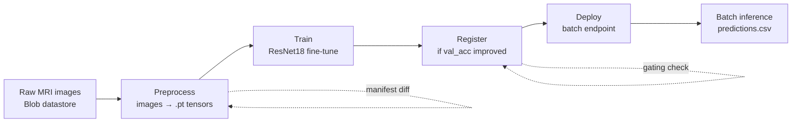

# 🧠 Brain Tumour Classification

Classify brain MRI scans into four tumour categories using a fine-tuned ResNet18 convolutional neural network, deployed as a batch endpoint on Azure Machine Learning. The pipeline is change-aware — only new or modified data triggers reprocessing, retraining, and redeployment.

## Problem Statement

Radiologists face increasing workloads as MRI imaging becomes more accessible, and manual tumour classification from scans is time-consuming, subjective, and prone to inter-observer variability. Automated classification systems can triage incoming scans, flag suspicious cases for urgent review, and provide a consistent second opinion — freeing clinicians to focus on ambiguous or complex cases.

Deep learning models based on convolutional neural networks have demonstrated strong performance on medical imaging tasks, but productionising them presents additional challenges:

- **Data drift** — new scans arrive continuously, and the model must be retrained as data changes over time.
- **Model governance** — only demonstrably better models should be promoted to production, with full lineage tracking back to the training data version.
- **Reproducibility** — every deployed model must be traceable to the exact data, code, and hyperparameters used to train it.

This lab implements an MLOps pipeline that addresses all three concerns: incremental preprocessing via manifest diffing, validation-accuracy gating at the registration step, and full MLflow experiment tracking with tagged data assets.

## Dataset

This lab uses the publicly available [Brain Tumor Classification (MRI)](https://www.kaggle.com/datasets/sartajbhuvaji/brain-tumor-classification-mri) dataset from Kaggle.

| Property  | Value                                    |
|-----------|------------------------------------------|
| Source    | Kaggle                                   |
| Modality  | T1-weighted contrast-enhanced MRI        |
| Images    | ~3,264 (Training + Testing combined)     |
| Format    | JPEG                                     |
| Classes   | 4 (see below)                            |
| Splits    | Pre-split into `Training/` and `Testing/` folders |

### Classification Classes

| Index | Class               | Description                                      |
|-------|---------------------|--------------------------------------------------|
| 0     | `glioma_tumor`      | Tumours originating in glial cells              |
| 1     | `meningioma_tumor`  | Tumours arising from the meninges                |
| 2     | `no_tumor`          | Healthy brain scans (negative class)             |
| 3     | `pituitary_tumor`   | Tumours of the pituitary gland                   |

Download the dataset from Kaggle and upload to your workspace's default datastore under `brain_tumour_data/` preserving the `Training/` and `Testing/` folder structure.

### Preprocessing & Augmentation

Each raw image is:
1. Resized to 512×512
2. Normalised using ImageNet mean/std statistics
3. Saved as a `.pt` tensor with its label

Training images additionally receive **3 augmented copies** per original (configurable), applying random horizontal/vertical flips, ±30° rotation, and ±20% brightness/contrast jitter. Testing images are never augmented.

## Pipeline Architecture



### Change-Aware Execution

Each pipeline step skips work when possible:

- **Preprocess** compares the current raw-image manifest against the previous data asset's manifest tag; only new or changed files are reprocessed.
- **Train** only runs if the training split changed. Hyperparameters and per-epoch metrics are logged to MLflow.
- **Register** only registers the new model if it beats the existing registered model on validation accuracy.
- **Deploy** only redeploys if a new model was registered, or re-invokes batch inference if only the testing split changed.

## Model Architecture

ResNet18 pretrained on ImageNet, fine-tuned end-to-end with a custom classification head:

```
Input (3, 512, 512)
    │
    ▼
ResNet18 backbone (all layers trainable)
    │
    ▼
Dropout(0.4) → Linear(512, 256) → ReLU → Dropout(0.4) → Linear(256, 4)
    │
    ▼
Logits over 4 classes
```

Training uses **differential learning rates** — the new FC head trains at 10× the backbone rate — with a `ReduceLROnPlateau` scheduler on validation loss.

### Training Configuration

| Parameter          | Value    |
|--------------------|----------|
| Base Learning Rate | 1e-5     |
| FC Head LR         | 1e-4 (10× base) |
| Batch Size         | 32       |
| Max Epochs         | 25       |
| Validation Split   | 20%      |
| Optimizer          | Adam     |
| Scheduler          | ReduceLROnPlateau (patience=3, factor=0.5) |
| Loss               | CrossEntropyLoss |
| Dropout            | 0.4      |
| Image Size         | 512×512  |
| Augmentations      | 3 per training image |

## Prerequisites

- Azure subscription with Contributor access
- Azure ML workspace with a GPU compute cluster (default name: `gpu1`)
- Azure CLI with the ML v2 extension (`az extension add -n ml`)
  - Ensure the v1 extension is removed: `az extension remove -n azure-cli-ml`
- Python 3.10+ with a virtual environment
- System-assigned managed identity (SAMI) on the compute cluster with **Contributor** role on the workspace
- Raw MRI data uploaded to the workspace's default datastore under `brain_tumour_data/`:
  ```
  brain_tumour_data/
  ├── Training/
  │   ├── glioma_tumor/
  │   ├── meningioma_tumor/
  │   ├── no_tumor/
  │   └── pituitary_tumor/
  └── Testing/
      ├── glioma_tumor/
      ├── meningioma_tumor/
      ├── no_tumor/
      └── pituitary_tumor/
  ```

## How to Run

### 1. Clone and configure

```bash
git clone https://github.com/Azure-Samples/AzureML_industry_labs.git
cd AzureML_industry_labs/brain_tumour_classification
cp .env.example .env
```

Fill in `.env` with your Azure details (subscription ID, resource group, workspace name, managed identity client ID).

### 2. Build and register the custom environment (one-time)

```bash
az ml environment create \
  --name brain-tumour-env \
  --build-context . \
  --dockerfile-path Dockerfile \
  --resource-group <rg> \
  --workspace-name <ws>
```

### 3. Create a workspace config

Save as `config.json` at the project root (or in `~/.azureml/`):

```json
{
  "subscription_id": "<your-subscription-id>",
  "resource_group": "<your-resource-group>",
  "workspace_name": "<your-workspace-name>"
}
```

### 4. Install local dependencies

```bash
pip install azure-ai-ml azure-identity azureml-fsspec
```

### 5. Submit the pipeline

```bash
python main.py
```

### 6. Monitor in Azure ML Studio

The Studio URL is printed on submission. Track:

- Per-epoch training and validation loss/accuracy curves
- Best validation accuracy per run
- Model registration decisions and deployment flags
- Batch endpoint inference results

## Running Inference

Once the pipeline completes and the batch endpoint is deployed, the final pipeline step automatically invokes it against the latest testing data asset. To manually re-run inference:

### Via Azure CLI

```bash
az ml batch-endpoint invoke \
  --name brain-tumour-batch \
  --deployment-name brain-tumour-deployment \
  --input azureml:brain-tumour-processed-testing:<version> \
  --resource-group <rg> \
  --workspace-name <ws>
```

### Via Python SDK

```python
from azure.ai.ml import MLClient, Input
from azure.ai.ml.constants import AssetTypes
from azure.identity import DefaultAzureCredential

ml_client = MLClient.from_config(credential=DefaultAzureCredential())

testing_asset = ml_client.data.get("brain-tumour-processed-testing", label="latest")

job = ml_client.batch_endpoints.invoke(
    endpoint_name="brain-tumour-batch",
    input=Input(type=AssetTypes.URI_FOLDER, path=testing_asset.path),
)
print(f"Batch job submitted: {job.name}")
ml_client.jobs.stream(job.name)
```

## Outputs

| Artefact              | Type                             | Description                                                                 |
|-----------------------|----------------------------------|-----------------------------------------------------------------------------|
| Processed tensors     | Azure ML Data Asset (URI_FOLDER) | `.pt` tensors for Training (with augmentations) and Testing splits, tagged with raw-image manifest |
| Trained model weights | Azure ML Model                   | `best_model.pt` with tags for `val_acc`, `trained_on_version`, `tested_on_version` |
| MLflow experiment     | Experiment runs                  | Per-epoch train/val loss and accuracy, best validation accuracy             |
| Batch endpoint        | `brain-tumour-batch`             | Produces `predictions.csv` with per-image class predictions                 |
| Predictions           | `predictions.csv`                | Columns: `filename`, `predicted_class`, `class_index`                       |

### Sample Output

```
filename            predicted_class   class_index
image(1).pt         glioma_tumor      0
image(2).pt         no_tumor          2
image(3).pt         pituitary_tumor   3
image(4).pt         meningioma_tumor  1
```

## Project Structure

```
brain_tumour_classification/
├── main.py                      # Pipeline orchestration & job submission
├── config.py                    # Centralised configuration (all tuneable values)
├── requirements.txt             # Pinned Python dependencies
├── Dockerfile                   # Custom Azure ML environment (GPU)
├── README.md                    # This file
├── .env.example                 # Environment variable template
├── .amlignore                   # Azure ML snapshot exclusions
├── .gitignore                   # Git exclusions
├── model/
│   ├── __init__.py
│   └── cnn.py                   # BrainTumourCNN (ResNet18 fine-tuned)
├── data_processing/
│   ├── __init__.py
│   └── preprocess.py            # BrainTumourDataset class for .pt tensors
└── pipeline/
    ├── __init__.py
    ├── preprocess_step.py       # Step 1: Raw images → .pt tensors (manifest-diffed)
    ├── train_step.py            # Step 2: Fine-tune ResNet18 + MLflow logging
    ├── register_model.py        # Step 3: Register model if val_acc improved
    ├── deploy_endpoint.py       # Step 4: Deploy batch endpoint + invoke inference
    └── score.py                 # Scoring script for batch inference
```

## Configuration

All tuneable values live in `config.py` and can be overridden via environment variables (see `.env.example`). Key settings:

| Setting                  | Default                          | Description                               |
|--------------------------|----------------------------------|-------------------------------------------|
| `COMPUTE_CLUSTER`        | `gpu1`                           | Azure ML compute cluster name             |
| `ENVIRONMENT_NAME`       | `brain-tumour-env@latest`        | Azure ML environment reference            |
| `MODEL_NAME`             | `brain-tumour-cnn`               | Registered model name                     |
| `ENDPOINT_NAME`          | `brain-tumour-batch`             | Batch endpoint name                       |
| `TRAINING_ASSET`         | `brain-tumour-processed-training`| Training data asset name                  |
| `TESTING_ASSET`          | `brain-tumour-processed-testing` | Testing data asset name                   |
| `DEFAULT_EPOCHS`         | `25`                             | Training epochs                           |
| `DEFAULT_LEARNING_RATE`  | `1e-5`                           | Base learning rate (FC head gets 10×)     |
| `DEFAULT_BATCH_SIZE`     | `32`                             | Training batch size                       |
| `DEFAULT_N_AUGMENTATIONS`| `3`                              | Augmented copies per training image       |
| `DEFAULT_IMAGE_SIZE`     | `512`                            | Input image resolution                    |
| `DEFAULT_DROPOUT`        | `0.4`                            | Dropout rate in classification head       |

## Tech Stack

| Technology            | Version / Detail                               |
|-----------------------|------------------------------------------------|
| Python                | 3.10+                                          |
| PyTorch               | 2.1.0                                          |
| Torchvision           | 0.16.0                                         |
| MLflow                | 2.9.2                                          |
| Azure ML SDK          | v2 (`azure-ai-ml`)                             |
| Experiment Tracking   | `azureml-mlflow`                               |
| Authentication        | `DefaultAzureCredential` (local), `ManagedIdentityCredential` (in-pipeline) |
| Compute               | Azure ML managed GPU cluster                   |
| Deployment            | Azure ML Batch Endpoints                       |
| Base Image            | `openmpi4.1.0-cuda11.8-cudnn8-ubuntu22.04`     |
| Model Architecture    | ResNet18 (ImageNet-pretrained, fine-tuned)     |
